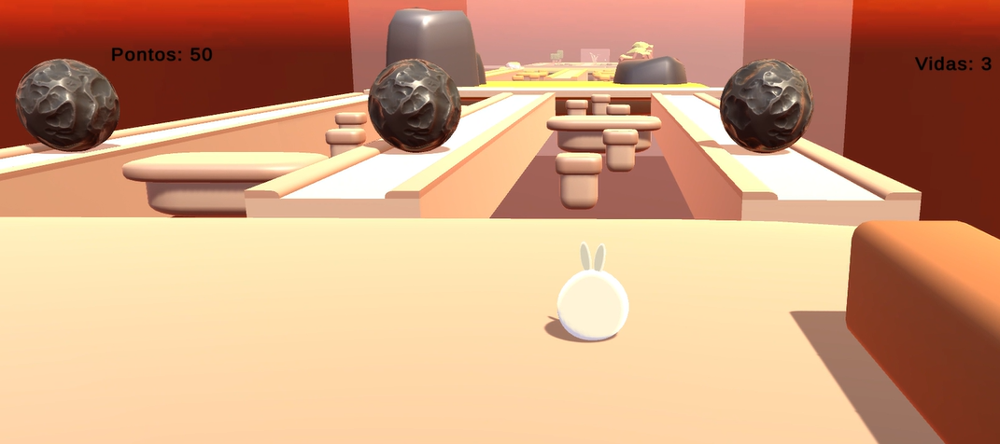

# SlimeGame
<<<<<<< HEAD

## As Aventuras de Mi

### Genêro

O jogo consiste em pular por diversas plataformas fixas e desviar de elementos do
ambiente, é um jogo de plataforma, mas tem como diferencial as perguntas sobre
computação respondidas durante a gameplay.

### Jogadores

O jogo é não suporta nenhum tipo de multiplayer, é exclusivamente singleplayer.

## História

Mi era um slime qualquer fazendo o que fazia de melhor: comer. Até que, um dia,
alguém o jogou em um jogo de atletismo e conhecimento. Agora, Mi só quer saber
de sobreviver, para que possa voltar a comer aquelas deliciosas gramíneas que
ficavam na floresta.
Para isso, ele deverá responder corretamente às questões sobre computação, além
de se mostrar ágil contra os desafios que se encontram à sua frente.

## Aspectos técnicos

### Controle

O jogador é controlado com os seguintes botões:
• “W”: Anda para frente
• “S”: Anda para trás
• “A”: Anda para esquerda do personagem
• “D”: Anda para direita do personagem
• “Space”: Pula
• Mouse controla a câmera

### Forma Técnica

O jogo é desenvolvido em um formato 3D

### Câmera

A câmera do jogo é caracterizada por ser em terceira pessoa e seguir o player de
forma dinâmica e natural.

### Plataforma

O jogo é desenvolvido exclusivamente para o computador

### Linguagem

A linguagem principal é C#.

### Assets

• Low poly Props
• Low poly Office Props
• Low poly Asteroids
• Slime FREE
• Fantasy skybox

## Game Play

O personagem principal é um Slime com orelhas de coelho e possui 1000 anos, a sua história é
simples, ele vivia de forma feliz em uma floresta, mas foi abduzido para outro lugar. O Slime é
calmo e acredita que vai resolver os problemas. Ele possui como único poder especial sua
perseverança e desejo de aprender. O jogo se inicia em uma plataforma e tem como objetivo
responder as perguntas de computação.

## Documento de Design

### Guia geral de Design

O jogo utiliza imagens simples e conta apenas com assets Low Poly a fim de ser
visualmente agradável e ser digerido de forma simples pelo público.

### Definições de game design

O jogador ganha ao completar todas as perguntas e passar por desafios sem perder todas as vidas. Já a derrota ocorre quando o player perde por todas as vidas seja por cair para fora dos obstáculos ou ao esbarrar nos asteroides.

### Definição do player

O principal (e único personagem jogável) é o Mi, um Slime fofo que possui orelhas de coelho. O player pode utilizar computadores para abrir barreiras, e para responder as perguntas educativas.

### Recompensas do Jogador

O jogador pode ganhar pontos ao responder perguntas de forma correta e perde pontos ao respondê-las de forma errada.

### Interface

A interface é simples e contem poucos botões para ser extremamente intuitiva. As letras são grandes e facilmente lidas
=======
A game about a slime
>>>>>>> 80cd9acad6586655c07e32a27e773fba3be7b127
